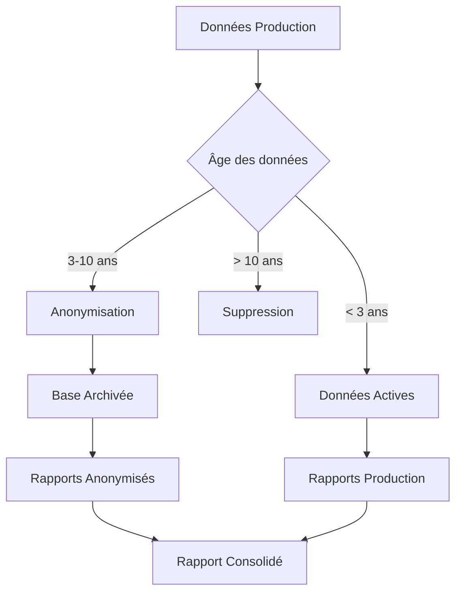

# Exercice 1 : Conformité RGPD

## 1. Analyse des données personnelles et durées de conservation

### Données personnelles identifiées

D'après le RGPD, sont considérées comme données personnelles :

- Données d'identification directe :
  - Nom et prénom des clients
  - Adresse email
  - Adresse postale
- Données sensibles :
  - Mots de passe (même chiffrés)
- Données transactionnelles :
  - Factures avec montants et dates (liées à une personne identifiée)

### Durées de conservation recommandées

| Type de donnée           | Durée de conservation         | Base légale                 |
| ------------------------ | ----------------------------- | --------------------------- |
| Données clients actifs   | 3 ans après dernière commande | Relation contractuelle      |
| Données de facturation   | 10 ans                        | Obligation légale comptable |
| Mots de passe            | Jusqu'à suppression compte    | Sécurité                    |
| Adresses email marketing | 3 ans sans interaction        | Intérêt légitime            |

### Processus de conformité RGPD



## 2. Installation et configuration

### Prérequis

```bash
# Vérification des prérequis
sudo systemctl status mysql
groups $USER | grep sudo
```

### Installation de la base de données

```bash
# Exécuter le script de configuration
chmod +x scripts/setup_database.sql
mysql -u root -p < scripts/setup_database.sql
```

### Configuration des tâches automatisées

```bash
# Installation des scripts
chmod +x scripts/*.sh
sudo ./scripts/setup_cron.sh
```

## 3. Architecture de la solution

### Base de données production

```sql
-- Structure simplifiée
CREATE DATABASE rgpd_production;
USE rgpd_production;

CREATE TABLE clients (
    id INT PRIMARY KEY AUTO_INCREMENT,
    nom VARCHAR(100),
    prenom VARCHAR(100),
    email VARCHAR(255),
    adresse TEXT,
    mot_de_passe VARCHAR(255),
    date_creation DATETIME,
    derniere_commande DATETIME
);

CREATE TABLE factures (
    id INT PRIMARY KEY AUTO_INCREMENT,
    client_id INT,
    montant_ttc DECIMAL(10,2),
    date_facture DATE,
    FOREIGN KEY (client_id) REFERENCES clients(id)
);
```

### Base d'archivage

```sql
-- Données anonymisées
CREATE DATABASE rgpd_archive;
USE rgpd_archive;

CREATE TABLE clients_anonymises (
    id_anonyme VARCHAR(32),
    region_code VARCHAR(10),
    date_creation_mois DATE,
    derniere_commande_mois DATE
);

CREATE TABLE factures_anonymisees (
    id INT PRIMARY KEY AUTO_INCREMENT,
    client_anonyme VARCHAR(32),
    montant_ttc DECIMAL(10,2),
    date_facture DATE
);
```

## 4. Scripts automatisés

### Script d'anonymisation (scripts/anonymize_data.sh)

Ce script :

1. Identifie les données à anonymiser (> 3 ans)
2. Transfère les données vers la base d'archive en les anonymisant
3. Supprime les données personnelles de la base production
4. Supprime définitivement les données > 10 ans

### Script de génération de rapports (scripts/generate_report.sh)

Génère un rapport mensuel consolidé incluant :

- CA des données actives (production)
- CA des données archivées (anonymisées)
- Agrégation par mois sur la période demandée

### Configuration cron

```bash
# Dans /etc/crontab
# Anonymisation quotidienne à 2h
0 2 * * * user /path/to/anonymize_data.sh

# Rapport annuel le 22 décembre à 4h
0 4 22 12 * user /path/to/generate_report.sh annual
```

## 5. Utilisation

### Génération manuelle d'un rapport

```bash
# Rapport mensuel pour janvier 2024
./scripts/generate_report.sh 2024-01

# Rapport annuel pour 2023
./scripts/generate_report.sh 2023
```

### Vérification du processus d'anonymisation

```bash
# Vérifier les logs
tail -f /var/log/rgpd_anonymization.log

# Compter les enregistrements par base
mysql -u root -p -e "SELECT COUNT(*) FROM rgpd_production.clients;"
mysql -u root -p -e "SELECT COUNT(*) FROM rgpd_archive.clients_anonymises;"
```

## 6. Sécurité et bonnes pratiques

> Sécurité : Les scripts utilisent des variables d'environnement pour les credentials MySQL et chiffrent les sauvegardes.

> Traçabilité : Tous les processus d'anonymisation sont loggés avec horodatage pour audit RGPD.

> Réversibilité : Impossible par design - une fois anonymisées, les données ne peuvent plus être reliées aux personnes.

## Scripts fournis

- `scripts/setup_database.sql` : Création des bases et jeu de test
- `scripts/anonymize_data.sh` : Processus d'anonymisation automatique
- `scripts/generate_report.sh` : Génération des rapports consolidés
- `scripts/setup_cron.sh` : Configuration des tâches automatisées
