# Schéma du processus RGPD

## Architecture du système

## Flux de données détaillé

## Calendrier d'exécution

```mermaid
gantt
    title Tâches automatisées RGPD
    dateFormat  HH:mm
    axisFormat %H:%M
    
    section Quotidien
    Vérification mensuelle :milestone, m1, 01:00, 0m
    Anonymisation quotidienne :crit, active, 02:00, 30m
    Nettoyage logs :done, 03:00, 15m
    
    section Annuel
    Rapport annuel automatique :milestone, 04:00, 0m
```

## Conformité RGPD

### Durées de conservation

| Type de donnée | Durée | Base légale | Action |
|---|---|---|---|
| Données personnelles clients actifs | < 3 ans | Relation contractuelle | Conservation production |
| Données personnelles clients inactifs | 3-10 ans | Obligation comptable | Anonymisation → Archive |
| Données comptables anonymisées | 10 ans max | Code commerce | Suppression définitive |

### Processus d'anonymisation

1. **Identification** : Sélection des données selon critères temporels
2. **Anonymisation** : 
   - Hash SHA-256 des identifiants
   - Généralisation géographique (région vs adresse complète)
   - Suppression liens vers données personnelles
3. **Archivage** : Transfert vers base dédiée
4. **Suppression** : Effacement données personnelles originales
5. **Traçabilité** : Enregistrement logs d'audit

### Garanties techniques

- **Irréversibilité** : Impossible de retrouver l'identité depuis les données anonymisées
- **Isolation** : Bases de données séparées (production/archive)
- **Chiffrement** : Mots de passe hashés SHA-256
- **Audit** : Logs complets des opérations d'anonymisation
- **Automatisation** : Processus sans intervention humaine